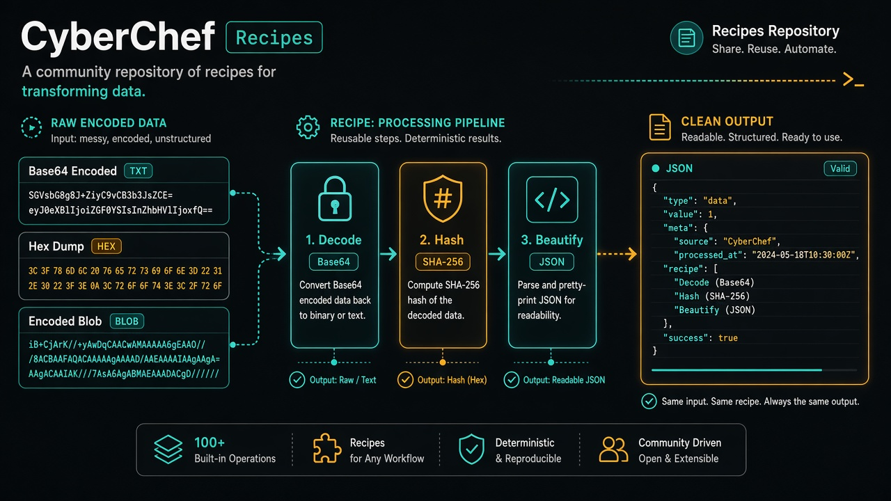

<p align="center">
  
</p>

<h1 align="center">cyberchef-recipes</h1>

<p align="center">
  <strong>EN</strong> Ready-to-use CyberChef recipes for encoding, hashing, JWT, compression &amp; cleanup<br/>
  <strong>PT</strong> Receitas CyberChef prontas — encoding, hash, JWT, compressão e limpeza de dados
</p>

<p align="center">
  <a href="https://github.com/manansbdb/cyberchef-recipes/blob/main/LICENSE"></a>
  
  
  <a href="#support--apoio"></a>
</p>

---

## What it does / Para que serve

| English | Português |
|---------|-----------|
| A curated set of **importable CyberChef recipes** so you don’t rebuild common pipelines every time. | Conjunto de **receitas CyberChef importáveis** para não remontares pipelines comuns de cada vez. |
| Drop JSON into CyberChef → transform data locally in the browser. | Cola o JSON no CyberChef → transforma dados localmente no browser. |


---

## Install / Instalação

### Option A — Use online (no install) / Opção A — Online (sem instalar)

1. Open [CyberChef](https://gchq.github.io/CyberChef)
2. Clone or download this repo:
   ```bash
   git clone https://github.com/manansbdb/cyberchef-recipes.git
   cd cyberchef-recipes
   ```
3. Open a file under `recipes/` (e.g. `decode-base64.json`)
4. In CyberChef: **Load / Save → Load recipe** → paste the JSON

### Option B — Local CyberChef / Opção B — CyberChef local

```bash
# Download the official release zip from:
# https://github.com/gchq/CyberChef/releases
# Unzip and open CyberChef_v*.html in your browser
# Then Load recipe as above
```

### Requirements / Requisitos

- A modern browser (Chrome, Firefox, Edge, Safari)
- Optional: `git` to clone this repository

---

## Quick start / Início rápido

```bash
git clone https://github.com/manansbdb/cyberchef-recipes.git
cd cyberchef-recipes
ls recipes/
# copy JSON → CyberChef → Load recipe → Bake
```

---

## Recipes index / Índice de receitas

| Recipe | File | Purpose |
|--------|------|---------|
| Base64 → text | [`recipes/decode-base64.json`](./recipes/decode-base64.json) | Decode Base64 |
| Text → Base64 | [`recipes/encode-base64.json`](./recipes/encode-base64.json) | Encode Base64 |
| SHA-256 | [`recipes/hash-sha256.json`](./recipes/hash-sha256.json) | Hash input |
| JWT decode | [`recipes/jwt-decode.json`](./recipes/jwt-decode.json) | Header + payload |
| URL decode | [`recipes/url-decode.json`](./recipes/url-decode.json) | Query strings |
| Gunzip | [`recipes/gunzip.json`](./recipes/gunzip.json) | Decompress gzip |
| Extract IPs | [`recipes/extract-ips.json`](./recipes/extract-ips.json) | IPv4 from logs |
| JSON beautify | [`recipes/json-beautify.json`](./recipes/json-beautify.json) | Pretty JSON |

---

## Project layout / Estrutura

```text
cyberchef-recipes/
├── docs/banner.png      # Hero artwork
├── recipes/*.json       # Importable recipes
├── SUPPORT.md           # Donations
├── CONTRIBUTING.md
└── README.md
```

---

## Support / Apoio

Bitcoin donations welcome / Doações em Bitcoin bem-vindas:

```
bc1q0qfnlnxyum9u45stzxe0a7jnhtj4j0usfkqdjw
```

Details in [SUPPORT.md](./SUPPORT.md).

---

## License / Licença

[MIT](./LICENSE) © 2026 manansbdb
